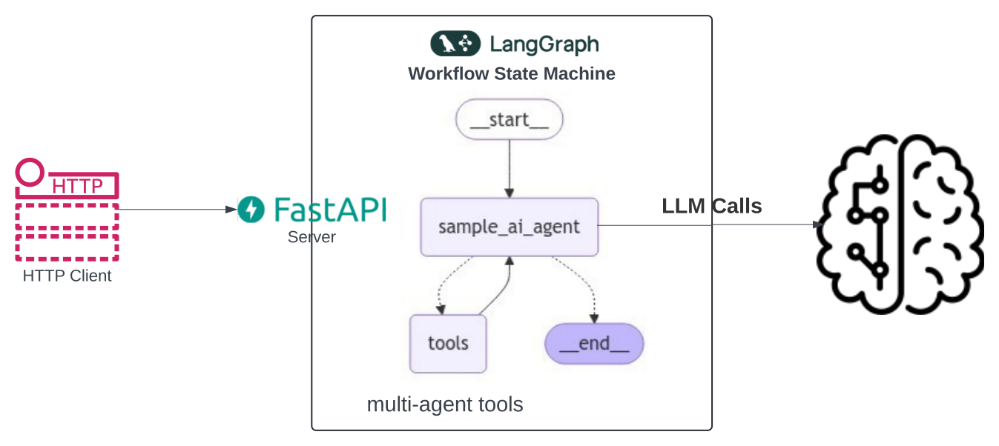

# simple-ai-agent

This repo demonstrates building a simple ReAct AI agent to perform tasks such as retrieving GitHub repo details via REST APIs, using LangGraph to define workflows.



## Jupyter Notebook

- Open [Jupyter Notebook](simple_ai_agent.ipynb) in VS Code

## Run the code locally

```
make run
```

Sample Output:
```
Generated UUID: 4e12e5df-4d95-4c85-a5f5-004f5cffbea9
INFO:     Started server process [74521]
INFO:     Waiting for application startup.
INFO:     Application startup complete.
INFO:     Uvicorn running on http://localhost:8000 (Press CTRL+C to quit)
```

## Test the code

### curl request as a client

```
curl --location 'localhost:8000/question' \
--header 'Content-Type: application/json' \
--data '{
    "question": "Get repo description for simple-ai-agent in sriaradhyula org"
}'
```

---
> _Code Disclaimer:_ The code provided in this repo is for educational and informational purposes only. While every effort is made to ensure the code is functional and accurate, it is provided "as-is" without any guarantees. Use the code at your own risk. The author is not responsible for any damage or data loss caused by implementing the code. Always review and test code in a safe environment before using it in production.